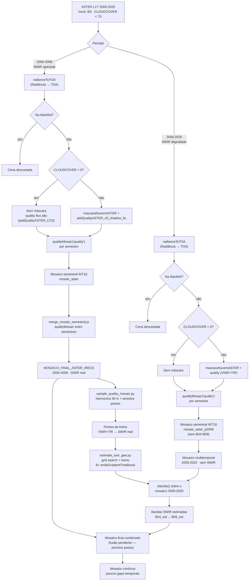

# Resumo da Metodologia — Mosaicos ASTER sem Nuvens (Irecê, BA)

> Projeto Prospectra 4.0 · Bloco Irecê (BA) · GEE `mapbiomas-arida` /
> `mapbiomas-caatinga-cloud02`
>
> Este documento resume, em linguagem corrida, a metodologia empregada para
> construir os mosaicos multitemporais ASTER sem nuvens usados na
> prospecção mineral da área de Irecê, complementando o roteiro técnico já
> registrado em
> [`src/building_dataset/readme_notas.md`](src/building_dataset/readme_notas.md).
> As referências a scripts e funções apontam para os arquivos reais do
> repositório.

## 1. Introdução — Por que processamento em nuvem (cloud computing)

Antes de descrever a metodologia em si, vale situar a escolha de
plataforma: todo o pipeline deste documento — da leitura das cenas ASTER
brutas até a exportação dos mosaicos finais — roda inteiramente no
**Google Earth Engine (GEE)**, uma plataforma de processamento geoespacial
em nuvem. Essa escolha não é incidental: é o que torna o problema tratável
na escala em que ele existe.

O bloco de Irecê definido nos scripts (`list_coord`, replicado em todas as
etapas) cobre um retângulo de aproximadamente **570 km × 595 km** — da
ordem de **340.000 km²**. Um único mosaico multitemporal para essa área,
nas ~15 bandas exportadas (VNIR 15 m + SWIR 30 m + TIR 90 m + índices +
quality) a 15 m de resolução nominal, soma da ordem de **1,5 bilhão de
pixels por banda** — e o pipeline gera um mosaico desses por semestre, ao
longo de **20 anos** (2000–2020, ~40 semestres). Somado às centenas de
cenas ASTER L1T brutas necessárias para cobrir o bloco inteiro em cada
semestre (cada cena cobre apenas ~60×60 km), o volume de dados que
transita pelo pipeline é da ordem de **terabytes**, não gigabytes.

Processar esse volume localmente — baixar cada cena L1T, reprojetar,
mascarar nuvem/sombra pixel a pixel, comparar `quality` entre centenas de
imagens e recompor o melhor pixel — exigiria armazenamento e poder de
processamento fora do alcance de uma estação de trabalho comum, além de
um tempo de processamento sequencial proibitivo. O GEE resolve isso de
duas formas complementares:

- **Os dados já estão na nuvem**: a coleção `ASTER/AST_L1T_003` (e as
  coleções Landsat/Sentinel usadas nos scripts de fusão espacial) já está
  ingerida e indexada no catálogo público do GEE — não é necessário
  baixar um único raster antes de processar.
- **O processamento é distribuído e paralelo**: cada operação pixel a
  pixel (`radianceToTOA`, `mascaraNuvemASTER`, `addQualityASTER_*`,
  `qualityMosaic`) é expressa de forma declarativa e executada por trás
  pelos servidores do Google, que particionam área e bandas em tiles
  processados em paralelo — o mesmo motivo pelo qual os scripts de
  amostragem usam o parâmetro `tileScale` para controlar esse
  particionamento.

Nesse desenho, cada `Export.image.toAsset` / `Export.table.toDrive` do
pipeline é o ponto em que um resultado — já reduzido de terabytes de
entrada para um mosaico ou uma amostra de pontos — sai da nuvem para
consumo (visualização, download de CSV, ou modelagem local). É esse
desenho que viabiliza repetir a mesma metodologia para 40 semestres e
20 anos de cobertura sem que o volume de dados se torne o fator limitante
do projeto.

## 2. Objetivo

Produzir um mosaico ASTER contínuo, de alta qualidade radiométrica e com o
mínimo de gaps espaciais/temporais, cobrindo o bloco de Irecê (BA), para
servir de insumo a análises de mapeamento geológico e prospecção mineral
(índices de argila, carbonato, óxidos de ferro etc.).

## 3. Decisões Críticas de Metodologia

Três decisões estruturam todo o restante da metodologia e precisam ser
justificadas antes de descrever o pipeline em si.

### 3.1 Por que ASTER, e não Landsat ou Sentinel-2?

Para prospecção mineral, o que importa não é a frequência temporal de
revisita (a litologia não muda de um ano para outro), e sim a **riqueza
espectral na região do SWIR**, onde ocorrem as feições de absorção que
distinguem os principais grupos de minerais de alteração:

| Sensor | Bandas totais | Bandas SWIR dedicadas | Cobertura 2.1–2.4 µm |
|---|---|---|---|
| **ASTER** | 14 (3 VNIR + 6 SWIR + 5 TIR) | **B04–B09** (6 bandas discretas, 30 m) | Resolvida em 6 bandas — separa argila (Al-OH), mica/AlMgOH, carbonato (CO₃) |
| Landsat 8/9 OLI/TIRS | 11 | 2 (SWIR1/SWIR2, largas) | 1 banda larga — sem resolução espectral para discriminar minerais de alteração |
| Sentinel-2 MSI | 13 | 2 (B11/B12, 20 m) | 1 banda larga, sem TIR |

O ASTER é o único sensor de acesso livre com bandas discretas o suficiente
no SWIR para calcular índices como **Al-OH (Caulinita)**, **Carbonato** e
**Ferric Iron** de forma diagnóstica (ver
[`bandas_ASTER.txt`](bandas_ASTER.txt) e a seção de índices em
`readme_notas.md`). Como a aplicação é geológica (não fenológica/agrícola),
a baixa frequência de revisita do ASTER é aceitável — abrindo uma janela de
aquisição ampla (originalmente **2000–2008**, período em que o detector
SWIR do ASTER ainda funcionava plenamente) em troca da riqueza espectral
que Landsat e Sentinel-2 não oferecem.

### 3.2 Por que uma blacklist manual, além do filtro por metadado?

O pipeline já filtra cenas por `CLOUDCOVER < 70` antes de qualquer
processamento (metadado da própria coleção `ASTER/AST_L1T_003`). Mesmo
assim, uma lista de exclusão manual (`blacklist`, em
[`select_black_list_save_mosaicSem.js`](src/building_dataset/select_black_list_save_mosaicSem.js))
foi necessária porque **a máscara de nuvens/sombras desenvolvida
(`mascaraNuvemASTER`) ainda não é robusta o suficiente para remover 100%
das nuvens e sombras de toda cena** — sobretudo bordas de nuvem e sombras
projetadas em relevo mais acidentado. Cenas identificadas visualmente como
muito comprometidas (ver crítica registrada em
[`aspectos_iniciais.txt`](src/building_dataset/aspectos_iniciais.txt))
são então removidas por `system:index` antes de entrar no
`qualityMosaic`, evitando que contaminem o mosaico semestral mesmo quando
teoricamente teriam "sobrevivido" ao score de qualidade.

### 3.3 Por que uma lista separada de imagens sem nuvem (zero-cloud)?

Pelo mesmo motivo inverso: como a máscara de nuvens/sombras não é
perfeita, ela também corre o risco de **falsos positivos** — mascarando
erroneamente solo exposto muito claro/escuro ou corpos de água como se
fossem nuvem/sombra. Para cenas com `CLOUDCOVER = 0` (comprovadamente sem
nuvem pelo metadado), não há necessidade de correr esse risco: elas
**pulam a etapa de máscara** inteiramente (`list_Cloud_zero` /
`Cloudlist_clean`) e são incorporadas ao mosaico já com os índices
espectrais calculados, mas sem `updateMask`.

## 4. Pipeline Completo

### 4.1 Pré-processamento radiométrico

Cada cena ASTER L1T chega em **radiância** (W·m⁻²·sr⁻¹·µm⁻¹). A função
`radianceToTOA` converte para **reflectância no topo da atmosfera (TOA)**
usando a irradiância solar exoatmosférica por banda (`ESUN`), a geometria
solar da cena (`SOLAR_ELEVATION`) e a correção de distância Terra-Sol pelo
dia do ano — sem isso, os índices espectrais (razões de banda) ficariam
distorcidos pela iluminação de cada cena.

### 4.2 Máscara de nuvens/sombras e camada de qualidade

`mascaraNuvemASTER` combina brilho visível (nuvem = alto brilho),
temperatura de brilho no TIR (nuvem = fria, percentil 20 da própria cena)
e uma projeção geométrica de sombra (direção oposta ao sol, distância
estimada por trigonometria a partir da elevação solar e uma altura de
nuvem assumida de 2000 m).

A mesma lógica espectral é reaproveitada para construir uma **camada de
quality contínua** (não binária), usada depois pelo `qualityMosaic`:

- `addQualityASTER_v5_shadow_fix` — versão atualmente usada para
  compor o score de cada pixel a partir de TIR (45%), brilho VNIR (25%),
  SAVI (15%) e NDWI (15%), mais um bônus proporcional a `CLOUDCOVER` baixo.
- `addQualityASTER_CC0` — para as cenas da lista *zero-cloud*: quality
  fixo e alto (`B01 > 0` × 22000, em INT16) para garantir que esses
  pixels **ganhem a disputa** pixel a pixel do `qualityMosaic` frente a
  pixels de cenas com nuvem residual, mesmo que estas tenham score alto.

Ou seja: o mesmo conjunto de variáveis espectrais que discrimina
nuvem/sombra na máscara binária é reciclado como score contínuo — cenas
mais limpas tendem a "vencer" naturalmente, e as cenas 100% limpas vencem
por construção.

### 4.3 Mosaico semestral de qualidade

Para cada `ano`/`semestre`, a coleção filtrada (sem blacklist) é dividida
em dois ramos — cenas zero-cloud (sem máscara) e cenas com nuvem (máscara
+ quality v5) — depois mesclados e reduzidos com
`collection.qualityMosaic('quality')`: o GEE seleciona, pixel a pixel, a
observação com maior valor de `quality` entre todas as cenas do semestre.
O resultado é convertido para INT16 (`converterPara16Bit`) e exportado
como asset (`ASTER_QualityMosaic_<ano>_semestre_<N>_INT16`).

### 4.4 Mosaico final multitemporal (2000–2008)

[`merge_mosaic_semestral.js`](src/building_dataset/merge_mosaic_semestral.js)
aplica o mesmo princípio um nível acima: a coleção de **mosaicos
semestrais** (cada um já com sua própria banda `quality`) é reduzida outra
vez com `qualityMosaic('quality')`, produzindo um único mosaico
multitemporal — `MOSAICO_FINAL_ASTER_IRECE` — que preserva, ano após ano,
o melhor semestre disponível em cada pixel. Este mosaico cobre **2000–2008**
e mantém as bandas SWIR (B04–B09) medidas de fato pelo sensor.

### 4.5 Extensão temporal 2009–2020 e o problema do SWIR ausente

Para ampliar a cobertura temporal além de 2008, o mesmo pipeline
(pré-processamento → máscara → quality → `qualityMosaic` semestral) foi
replicado para cenas **2009–2020**, exportadas numa coleção paralela
(`mosaic_aster_p2008`). O detector SWIR do ASTER degradou-se a partir de
2008/2009, então essas cenas **não têm bandas B04–B09 confiáveis** — a
camada de quality dessa fase usa apenas VNIR + TIR
(`addQualityASTER_v5_shadow_fix` já foi desenhada sem depender de SWIR
por essa razão).

### 4.6 Amostragem de treino a partir do mosaico 2000–2008

Para recuperar o SWIR nas cenas pós-2008 é necessário um modelo estatístico
treinado onde a "verdade" (SWIR real) existe. O script
[`sample_quality_mosaic.py`](src/building_dataset/sample_quality_mosaic.py)
harmoniza todas as bandas dos mosaicos semestrais de **2000–2008** para uma
resolução comum de 30 m (VNIR por `reduceResolution` 2×2, TIR por
`resample bilinear`, SWIR nativo) e extrai **30 000 pontos aleatórios**
por mosaico semestral, exportados como CSV/asset — isto é, amostra as
melhores áreas (maior `quality`) do período em que VNIR, TIR **e** SWIR
estão disponíveis simultaneamente, formando o conjunto de treino
`features = [B01,B02,B3N,B10,B11,B12,B13,B14] → targets = [B04..B09]`.

### 4.7 Modelagem — Gradient Tree Boosting (GTB) para estimar o SWIR

Com os pontos de treino em mãos, dois caminhos de modelagem foram
explorados (ver seção 7 para o algoritmo em detalhe):

- **GEE-side** — [`estimate_swir_gee.py`](src/modeling/estimate_swir_gee.py)
  (mirror interativo em `estimate_swir_gee.ipynb`): treina
  `ee.Classifier.smileGradientTreeBoost` diretamente no servidor GEE, um
  modelo por banda SWIR (6 no total). Este é o caminho **operacional**,
  porque aplica o modelo sobre a imagem inteira sem precisar exportar
  pixels para fora do GEE.
- **Local** — [`train_swir_models.py`](src/modeling/train_swir_models.py):
  treina PLS, XGBoost e GPR com scikit-learn sobre os mesmos CSVs, usado
  como **benchmark** (métricas R²/RMSE/MAE mais detalhadas) para validar
  se o GTB do GEE está numa faixa de desempenho razoável.

### 4.8 Estimação final e mosaico combinado

Os 6 modelos GTB treinados (etapa 4.7) são aplicados sobre as bandas
VNIR+TIR do mosaico **2009–2020** (`img_features.classify(...)`), gerando
as bandas `B04_est`…`B09_est` — o SWIR estimado onde o sensor não mediu
mais SWIR de forma confiável. A intenção metodológica final é combinar:

- **2000–2008** → SWIR **real** (medido), banda a banda;
- **2009–2020** → SWIR **estimado** (GTB), banda a banda;

em um único mosaico multitemporal contínuo, com gaps reduzidos a poucas
áreas onde nem cenas 2000–2008 nem 2009–2020 tiveram observação
utilizável. **Estado atual no repositório:** o script
`estimate_swir_gee.py` já aplica o estimador e exporta o resultado
(`projects/mapbiomas-arida/mine/swir_estimated`); a etapa de **fusão**
final entre esse asset estimado e o `MOSAICO_FINAL_ASTER_IRECE` (SWIR
real) ainda não existe como script único e comitado — é o próximo passo
natural do pipeline (`ee.ImageCollection([mosaico_real, mosaico_estimado])
.mosaic()` ou equivalente, priorizando o SWIR real onde disponível).

## 5. Scripts e Funções por Etapa

| Etapa | Script | Função(ões) principais | Papel |
|---|---|---|---|
| Radiância → TOA | `select_black_list_save_mosaicSem.js` | `radianceToTOA` | Reflectância TOA a partir de ESUN + geometria solar |
| Blacklist / zero-cloud | `select_black_list_save_mosaicSem.js` | `blacklist_clean`, `Cloudlist_clean` | Filtro manual de cenas ruins / cenas 100% limpas |
| Máscara nuvem/sombra | `select_black_list_save_mosaicSem.js` | `mascaraNuvemASTER` | Nuvem (brilho + TIR frio) e sombra (projeção geométrica) |
| Camada de qualidade | `select_black_list_save_mosaicSem.js` | `addQualityASTER_v5_shadow_fix`, `addQualityASTER_CC0` | Score contínuo por pixel (TIR/brilho/SAVI/NDWI) e bônus zero-cloud |
| Mosaico semestral | `select_black_list_save_mosaicSem.js` | `qualityMosaic('quality')`, `converterPara16Bit` | Melhor pixel do semestre; export INT16 |
| Mosaico final 2000–2008 | `merge_mosaic_semestral.js` | `qualityMosaic('quality')` | Consolida semestres em `MOSAICO_FINAL_ASTER_IRECE` |
| Amostragem de treino | `sample_quality_mosaic.py` | `harmonizar_para_30m`, `.sample()` | Harmoniza a 30 m e extrai pontos do mosaico 2000–2008 |
| Modelagem GTB (GEE) | `estimate_swir_gee.py` / `.ipynb` | `carregar_pontos`, `treinar_gbt`, `grid_search`/`calcular_rmse_val` | Treina 6 `smileGradientTreeBoost` (1 por banda SWIR) |
| Aplicação/estimação | `estimate_swir_gee.py` / `.ipynb` | `img_features.classify(...)` | Gera `B04_est`…`B09_est` sobre o mosaico sem SWIR |
| Benchmark local | `train_swir_models.py` | PLS / XGBoost / GPR (scikit-learn) | Validação cruzada do desempenho do GTB |

## 6. Bandas Utilizadas

| Banda | Sensor/Região | Comprimento de onda | Resolução | Papel na metodologia |
|---|---|---|---|---|
| B01 | VNIR — Verde | 0.520–0.600 µm | 15 m | RGB, brilho, quality, NDVI/SAVI |
| B02 | VNIR — Vermelho | 0.630–0.690 µm | 15 m | RGB, Ferric_Fe, NDVI/SAVI |
| B3N | VNIR — NIR | 0.780–0.860 µm | 15 m | Brilho, NDVI/SAVI, feature p/ GTB |
| B04 | SWIR1 | 1.600–1.700 µm | 30 m | Alvo GTB; SWIR Falsa-cor |
| B05 | SWIR2 (Al-OH) | 2.145–2.185 µm | 30 m | Alvo GTB; índice AlOH_Clay |
| B06 | SWIR3 (referência) | 2.185–2.225 µm | 30 m | Alvo GTB; denominador dos índices |
| B07 | SWIR4 (Al-Mg-OH) | 2.235–2.285 µm | 30 m | Alvo GTB; índice AlOH_Clay |
| B08 | SWIR5 (CO₃) | 2.295–2.365 µm | 30 m | Alvo GTB; índice Carbonate |
| B09 | SWIR6 | 2.360–2.430 µm | 30 m | Alvo GTB |
| B10–B14 | TIR | 8.125–11.65 µm | 90 m | Máscara de nuvem, quality, feature p/ GTB |

## 7. O Algoritmo GTB (Gradient Tree Boosting) para Estimação do SWIR

O estimador usado é o **`ee.Classifier.smileGradientTreeBoost`** do GEE
(implementação da biblioteca SMILE), configurado em modo `REGRESSION`,
um modelo independente por banda-alvo (6 modelos: B04…B09).

- **Entradas (features):** B01, B02, B3N (VNIR) + B10–B14 (TIR) — as
  únicas bandas disponíveis tanto no período de treino (2000–2008) quanto
  no período sem SWIR (2009–2020).
- **Saída:** valor contínuo estimado da respectiva banda SWIR (INT16).
- **Por que boosting de árvores, e não regressão linear direta:** a
  relação entre VNIR/TIR e cada banda SWIR não é linear (superfícies
  minerais distintas produzem combinações VNIR/TIR parecidas com
  respostas SWIR bem diferentes); ensembles de árvores capturam essas
  interações não-lineares sem exigir a escolha manual de termos de
  interação, como uma regressão linear exigiria.
- **Hiperparâmetros ajustados por grid search** (6 combinações,
  `PARAM_GRID`):
  - `numberOfTrees` (100–500) — nº de árvores do ensemble;
  - `shrinkage` (0.05–0.10) — taxa de aprendizado por árvore adicionada;
  - `samplingRate` (0.7–0.9) — fração dos dados usada por árvore
    (bagging);
  - `maxNodes` (64–256) — complexidade máxima de cada árvore (proxy de
    profundidade).
- **Validação:** split 80/20 (treino/validação) via `randomColumn`
  (`seed=42`, reprodutível); cada combinação do grid é avaliada pelo RMSE
  no conjunto de validação; a melhor combinação por banda é re-treinada no
  conjunto **completo** de pontos antes de ser aplicada à imagem.
- **Filtro de qualidade dos pontos de treino:** apenas pontos com
  `quality ≥ 5000` (INT16, ≈ 0.5 em escala física) entram no treino —
  evita que pixels de nuvem/sombra residual (que ainda tenham "sobrevivido"
  ao mosaico semestral) contaminem o aprendizado do modelo.
- **Aplicação:** `image.classify(classifier, '<banda>_est')` roda o
  modelo pixel a pixel sobre o mosaico inteiro, inteiramente no lado do
  servidor GEE — sem exportar a imagem para fora da plataforma.

## 8. Fluxograma da Metodologia

## 9. Limitações Conhecidas

Registradas originalmente em
[`aspectos_iniciais.txt`](src/building_dataset/aspectos_iniciais.txt) e
válidas para o estado atual da metodologia:

- **Sem correção atmosférica**: os índices são calculados sobre
  reflectância TOA, não reflectância de superfície — espalhamento
  atmosférico (haze) afeta VNIR e SWIR de forma desigual.
- **Deslocamento espacial entre cenas (paralaxe)**: o ASTER L1T não é
  ortorretificado com precisão em relevo acidentado; cenas de datas
  diferentes podem ter deslocamentos de até 30–50 m, o que o
  `qualityMosaic` (por não fazer médias) mitiga melhor que um `median`,
  mas não elimina.
- **Máscara de nuvem/sombra não é perfeita** (motivo direto das decisões
  3.2 e 3.3 acima) — ainda depende de blacklist manual para os piores
  casos.
- **SWIR estimado, não medido**, no período 2009–2020 — carrega a
  incerteza do modelo GTB (ver métricas de RMSE de validação por banda em
  `models/gee_best_params.json`).

## 10. Referências

- ASTER L1T — NASA LP DAAC.
- Rowan, L.C.; Mars, J.C. (2003). *Lithologic mapping in the Mountain
  Pass, California area using ASTER data* — base do índice Al-OH.
- Google Earth Engine — documentação de `qualityMosaic` e
  `smileGradientTreeBoost`.
- Documentação interna: [`README.md`](README.md),
  [`src/building_dataset/readme_notas.md`](src/building_dataset/readme_notas.md),
  [`src/building_dataset/aspectos_iniciais.txt`](src/building_dataset/aspectos_iniciais.txt).
